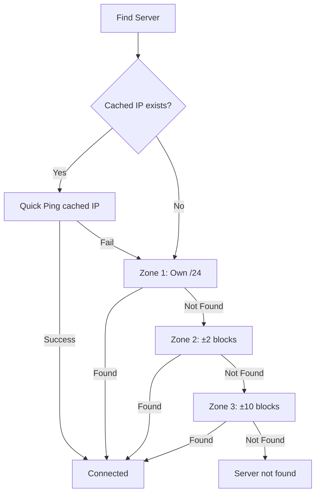

# K-Share: Encrypted Local Media Sharing

A high-performance, professional-grade alternative to cloud sharing. K-Share bridges the gap between your Android device and Windows PC with real-time synchronization, robust encryption, and a "set-and-forget" background architecture.

---

## Core Features

### Real-Time Clipboard
* **Instant Sync:** Uses WebSockets to push text and links between devices in milliseconds.
* **Rich Link Support:** URLs in the clipboard and history are automatically detected and clickable on both Android and the Web Dashboard.
* **History:** Securely stores the last 20 snippets with selective deletion support.

### Seamless File & Folder Transfer
* **Folder Support:** Transfer entire directory structures. The PC server zips folders on-the-fly, and the Android app automatically decrypts and unzips them, preserving your nested file hierarchy.
* **Recursive Uploads:** Pick an entire folder from your Android device to sync to your PC in one tap.
* **No-Overwrite Protection:** Automatic versioning (e.g., `document (1).pdf`) ensures you never lose a file by mistake.
* **Drag & Drop:** Drop files or entire folders directly into your browser to send them to your phone.
* **Smart Previews:** High-performance thumbnail generation for images with dual-layer (Memory + Disk) caching on Android.

### Security-First Design
* **AES-256-GCM:** All data (clipboard, file lists, and files) is wrapped in secured encryption.
* **Zero-Knowledge:** Your "Pairing Code" never leaves your local network. It is hashed (SHA-256) locally to derive encryption keys.
* **Smart Diagnostics:** Android app provides specific connection error messages (e.g., "Connection Refused", "Decryption Failed") for easy troubleshooting.
* **Replay Protection:** Encrypted payloads include UTC timestamps to prevent intercepted message re-injection.

### Desktop Integration
* **System Tray:** Runs silently in the Windows tray. Right-click to open the dashboard or exit.
* **Auto-Start:** Simply type `shell:startup` in the Run dialog (`Win+R`) and paste a shortcut to `k-share.exe` to have it start with Windows.
* **Open on PC:** One-tap from the Android share menu to instantly launch a URL in your laptop's default browser.

---

## Smart Network Discovery

K-Share uses an intelligent, tiered TCP-based discovery system that automatically finds your server on the local network.

### Discovery Journey: Why TCP?

| Approach | Problem |
|----------|---------|
| **mDNS (Bonjour/Avahi)** | Blocked on most university/corporate WiFi networks due to multicast restrictions |
| **GitHub Gist "Dead Drop"** | Requires internet access; fails on pure LAN/hotspot setups |
| **UDP Broadcast** | Also blocked by enterprise routers; unreliable packet delivery |
| **TCP Port Scanning** | Works everywhere - just standard HTTP requests that no network blocks |

### Priority Zone Scanning

The app scans in progressive zones, stopping immediately when the server is found:



| Zone | Range | IPs Scanned | Time |
|------|-------|-------------|------|
| Cached | Last known IP | 1 | <200ms |
| Zone 1 | Own /24 block | ~254 | <1s |
| Zone 2 | ±2 neighbor blocks | ~1,270 | ~2-3s |
| Zone 3 | ±10 blocks (deep) | ~5,334 | ~8-10s |

### Technical Implementation

**Worker Pool Architecture:**
- 60 concurrent coroutines with bounded Channel
- 150ms TCP connect timeout per IP
- **Shuffled Scanning:** IPs are shuffled before scanning to avoid triggering router flood protection or rate limiting often associated with sequential port scans.
- Early termination: All workers stop when server found

**Hotspot Mode Detection:**
- Prioritizes AP/tethering interfaces over mobile data
- Correctly detects `10.x.x.x` hotspot LAN even when phone shows `100.x.x.x` carrier IP

**Context-Aware Caching:**
- Stores last working IP per network subnet (e.g., `192.168.1` → `192.168.1.50`)
- Auto-connects in <200ms on known networks

### Manual IP Fallback

If auto-discovery fails (very large enterprise networks), you can:
1. Type the server IP directly in the input field
2. Press **Enter** to verify
3. On success, IP is cached for future auto-connect

---

## Compilation Guide (Windows Server)

You can compile the Go server into a single executable using one of two methods.

### Method 1: Console Mode (With Terminal)
Use this for initial setup or debugging.
```bash
cd windows-server
go build -trimpath -ldflags="-s -w" -o k-share.exe
```

### Method 2: Background Mode (Hidden Window)
Use this for daily usage. The server will start silently in the system tray.
```bash
cd windows-server
go build -trimpath -ldflags="-s -w -H windowsgui" -o k-share.exe
```

---

## Configuration

The server is controlled by `config.json` in the `windows-server` directory. 

> A template file `config.example.json` is provided. Rename it to `config.json` and fill in your details.

| Field | Description |
| :--- | :--- |
| `port` | The local port to run on (default: `26260`). |
| `pairing_code` | Your private password. Must match on both PC and Phone. |
| `to_phone_dir` | Local folder for files being sent to the phone. |
| `from_phone_dir` | Local folder for files uploaded from the phone. |

---

## Android Setup

1. Open the project in **Android Studio**.
2. Perform a **Build > Clean Project** then **Build > Rebuild Project**.
3. Install the APK on your device.
4. In **Settings**, enter your **Pairing Code** (must match your `config.json`).
5. Tap the **Refresh** button to discover the server.

### Settings

| Setting | Purpose |
|---------|---------|
| Theme | System / Light / Dark mode |
| Download Location | Choose where files are saved |
| Pairing Code | Must match Windows server config |
| Saved Networks | View/delete cached network → IP pairs |

---

## Technical Stack

* **Backend:** Go (Gorilla WebSockets, Systray, Resize Library)
* **Web:** Vanilla JavaScript, Web Crypto API (SubtleCrypto)
* **Mobile:** Kotlin, Jetpack Compose, WorkManager, OkHttp, LruCache, DocumentFile (SAF)
* **Discovery:** Priority Zone TCP Scanning with context-aware IP caching

---

## License
This project is private and intended for personal use.
