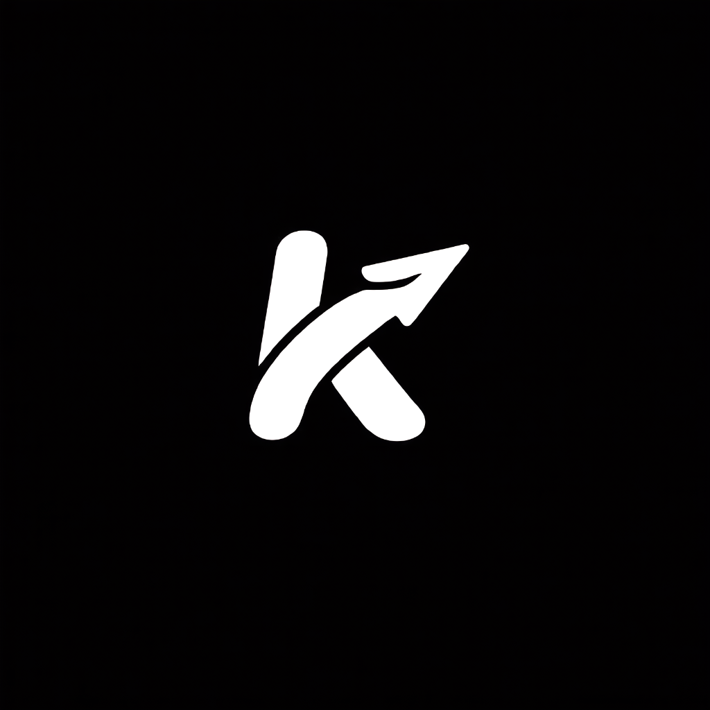
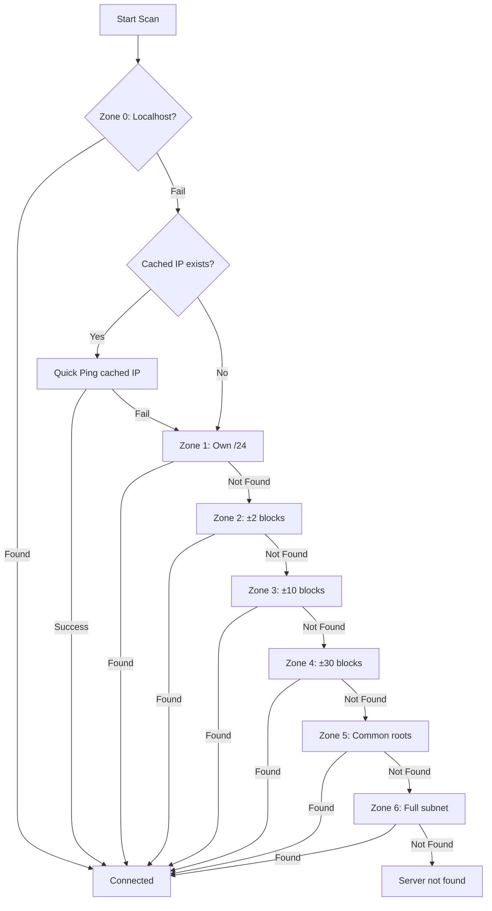

<p align="center">
  
</p>

# K-Share: Encrypted Local Media Sharing

A high-performance, professional-grade alternative to cloud sharing. K-Share bridges the gap between your Android device and Windows PC with real-time synchronization, robust encryption, and a "set-and-forget" background architecture.

---

## 🏗️ Architecture & Data Flow

K-Share operates on a Client-Server model running entirely within your local network (LAN). No data ever leaves your WiFi.

### 🟣 The Core: Windows Server
The heart of the system is the **Windows Server** (`windows-server`), a high-performance Go application that acts as the central hub.

*   **Role:** Handles storage, encryption/decryption, and coordinates communication.
*   **Protocols:** 
    *   **HTTP:** For file uploads/downloads and REST API.
    *   **WebSockets:** For real-time clipboard sync and events.
*   **Systray Integration:** Runs silently in the background. The system tray icon displays the current Local IP (for manual pairing if needed) and allows you to Exit.

### 🟢 The Mobile Client: Android App
The **Android App** is the primary interface for sharing from your phone.

*   **Sending Files (Upload):**
    1.  User shares a file/folder from Android.
    2.  App streams the data securely via **HTTPS (TLS 1.3)**.
    3.  Stream is POSTed to Server's `/upload` endpoint.
    4.  Server saves to disk (renaming duplicates if needed).
*   **Receiving Files (Download):**
    1.  App requests file list from `/files/tophone`.
    2.  User selects a file/folder.
    3.  Server streams the file (or zipped folder) via **HTTPS**.
    4.  App receives and saves to Downloads.

### 🔵 The Desktop Client: Windows Client
The **Windows Client** (`windows-client`) is a modern GUI dashboard built with [Fyne](https://fyne.io).

*   **Role:** Provides a user-friendly interface on the PC to manage files and clipboard without using a browser.
*   **Interaction:**
    *   **Clipboard:** Subscribes to WebSocket updates to sync clipboard instantly.
    *   **Files:** Lists files from the server's "From Phone" directory.

---

## 🔄 Interaction Diagram

```mermaid
sequenceDiagram
    participant A as Android Phone
    participant S as Windows Server
    participant C as Windows Client

    Note over A,C: 🔐 Traffic Encrypted (TLS 1.3 / HTTPS)

    rect rgb(20, 20, 30)
        Note left of A: 🔑 Authentication
        A->>S: GET /ping (Auth: Bearer Code)
        S->>S: Verify Code (Admin vs Guest)
        S-->>A: { status: "ok", role: "admin" }
        A->>A: Adapt UI (Show/Hide Private Clip)
    end

    rect rgb(30, 20, 20)
        Note left of A: 📂 File Transfer
        A->>S: POST /upload
        S->>S: Save to "Shared" (Renames duplicates)
        S->>C: WS Event: "File Received"
        C->>C: Refresh File List
    end

    rect rgb(20, 30, 20)
        Note right of C: 📋 Clipboard Sync (Role Based)
        C->>S: POST /clipboard (New Text)
        S->>S: Update specific channel (Private/Guest)
        S->>A: WS Event: "Clipboard Updated"
        A->>A: Update System Clipboard (If allowed)
    end
```



---

## 👥 Guest Mode & Access Control

K-Share now features a **Dual-Role System** to safely share your setup with others without exposing your private data.

### 🛡️ Admin Mode (You)
*   **Code:** Use `admin_code` from config.
*   **Access:** Full control. Can see **Private Clipboard** and **Guest Clipboard**. Can access **All Files**.
*   **UI:** Shows toggle to switch between Private/Guest channels.

### 👤 Guest Mode (Visitors)
*   **Code:** Use `guest_code` from config.
*   **Access:** Restricted. Can **ONLY** see **Guest Clipboard**. Can **ONLY** access files in the `Public/` subfolder.
*   **UI:** Simplified interface. "Private" options are completely hidden.

---

## Core Features
### Real-Time Clipboard
*   **Instant Sync:** Uses WebSockets (wss://) to push text and links between devices in milliseconds.
*   **Rich Link Support:** URLs in the clipboard and history are automatically detected and clickable.
*   **History:** Securely stores the last 20 snippets.
*   **Dual Channels:** Separate "Private" and "Guest" clipboards to keep work separate from visitors.

### Seamless File & Folder Transfer
*   **HTTPS Transfer:** All uploads and downloads occur over encrypted HTTPS streams.
*   **Folder Support:** Transfer entire directory structures. The PC server zips folders on-the-fly, and the Android/Windows clients automatically decrypt and unzip them, preserving hierarchy.
*   **Recursive Uploads:** Pick an entire folder from your Android device to sync to your PC in one tap.
*   **No-Overwrite Protection:** Automatic versioning (e.g., `document (1).pdf` or `Folder (1)`) ensures you never lose a file by mistake.

### Security-First Design
*   **TLS 1.3 Encryption:** K-Share uses **self-signed certificates** generated on-the-fly to ensure all traffic is encrypted end-to-end, even on local networks.
*   **TOFU Certificate Pinning:** Both Android and Windows clients implement **Trust On First Use** - on first connection, the server's certificate fingerprint is displayed for verification. Once trusted, subsequent connections verify the certificate hasn't changed, preventing man-in-the-middle attacks.
*   **Zero-Knowledge:** Codes never leave your local network.
*   **Role Separation:** Strict server-side enforcement of Guest restrictions.
*   **Path Traversal Protection:** Server validates all file paths to prevent directory escape attacks.

### Desktop Integration
*   **System Tray:** 
    *   **Open Shared Folder:** Quick access to your files.
    *   **Refresh IP:** Manually update network status.
*   **Windows Client:**
    *   **Open Button:** Instantly open downloaded files/folders.
    *   **Auto-Unzip:** Downloads folders as fully usable directories.
    *   **Thumbnail Previews:** Parallel loading with LRU caching (100 entries).
    *   **Light/Dark Theme:** Toggle between themes with one click.

---

## Smart Network Discovery

K-Share uses an intelligent, tiered TCP-based discovery system that automatically finds your server on the local network.

### Discovery Journey: Why TCP?

| Approach | Problem |
|----------|---------|
| **mDNS (Bonjour/Avahi)** | Blocked on most university/corporate WiFi networks due to multicast restrictions |
| **GitHub Gist "Dead Drop"** | Requires internet access; fails on pure LAN/hotspot setups |
| **UDP Broadcast** | Also blocked by enterprise routers; unreliable packet delivery |
| **TCP Port Scanning** | Works everywhere - just standard HTTP requests that no network blocks |

### Priority Zone Scanning

The app scans in progressive zones, stopping immediately when the server is found.

| Zone | Range | Description | IPs Scanned | Time |
|------|-------|-------------|-------------|------|
| **Zone 0** | `127.0.0.1` | **Client Only**. Checks localhost in case Server is on same PC. | 1 | <10ms |
| **Cached** | Last known IP | Checks the last successfully connected IP. | 1 | <200ms |
| **Zone 1** | Own /24 block | Scans the immediate local subnet. | ~254 | <1s |
| **Zone 2** | ±2 neighbor blocks | Scans adjacent subnets (common in some mesh/corporate setups). | ~1,270 | ~2-3s |
| **Zone 3** | ±10 blocks (deep) | Deep scan for complex enterprise networks. | ~5,334 | ~8-10s |
| **Zone 4** | ±30 blocks (wide) | Wide scan - catches edge cases like 0 vs 11 subnets. | ~15,494 | ~20-30s |
| **Zone 5** | Common roots (0,1,2) | Scans blocks 0, 1, 2 which are commonly used. | ~762 | ~1-2s |
| **Zone 6** | Full subnet | Full scan based on prefix length (/16 to /23). | Varies | Varies |



---

## Compilation Guide (Windows Server)

### Method 1: Console Mode (With Terminal)
```bash
cd windows-server
go build -trimpath -ldflags="-s -w" -o k-share.exe
```

### Method 2: Background Mode (Hidden Window)
```bash
cd windows-server
go-winres make
go build -trimpath -ldflags="-s -w -H windowsgui" -o k-share-server.exe
```

### Windows Client
```bash
cd windows-client
fyne package -os windows -icon ../assets/Icon.png -name k-share-client -release --app-id com.kshare.client
```

---

## Configuration

The server is controlled by `config.json` in the `windows-server` directory.

| Field | Description |
| :--- | :--- |
| `port` | The local port to run on (default: `26260`). |
| `admin_code` | **Master Password.** Full access to everything. |
| `guest_code` | **Visitor Password.** Restricted access (Guest Clip + Public Files). |
| `shared_dir` | The single root folder for all shared files (Uploads & Downloads). |

---

## Android Setup

1. Open the project in **Android Studio**.
2. Perform a **Build > Rebuild Project**.
3. Install the APK.
4. In **Settings**, enter your **Admin Code** (for you) or **Guest Code** (for others).
5. Tap **Refresh** to connect.

### Settings
| Setting | Purpose |
|---------|---------|
| Theme | System / Light / Dark mode |
| Download Location | Choose where files are saved |
| Pairing Code | Enter Admin or Guest code here |

---

## Technical Stack

*   **Backend (Server):** Go (Gorilla WebSockets, Systray, Resize Library)
*   **Frontend (Client):** Go (Fyne GUI Toolkit)
*   **Mobile:** Kotlin, Jetpack Compose, WorkManager, OkHttp, LruCache, DocumentFile (SAF)
*   **Discovery:** Priority Zone TCP Scanning with context-aware IP caching

---

## License
This project is licensed under the MIT License - see the [LICENSE](LICENSE) file for details.
