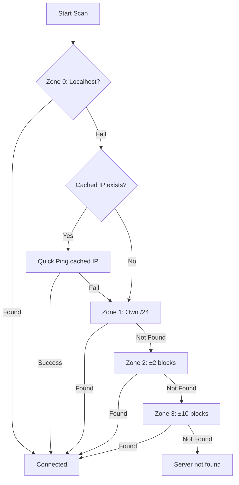

<p align="center">
  
</p>

# K-Share: Encrypted Local Media Sharing

A high-performance, professional-grade alternative to cloud sharing. K-Share bridges the gap between your Android device and Windows PC with real-time synchronization, robust encryption, and a "set-and-forget" background architecture.

---

## 🏗️ Architecture & Data Flow

K-Share operates on a Client-Server model running entirely within your local network (LAN). No data ever leaves your WiFi.

### 🟣 The Core: Windows Server
The heart of the system is the **Windows Server** (`windows-server`), a high-performance Go application that acts as the central hub.

*   **Role:** Handles storage, encryption/decryption, and coordinates communication.
*   **Protocols:** 
    *   **HTTP:** For file uploads/downloads and REST API.
    *   **WebSockets:** For real-time clipboard sync and events.
*   **Systray Integration:** Runs silently in the background. The system tray icon displays the current Local IP (for manual pairing if needed) and allows you to Exit.

### 🟢 The Mobile Client: Android App
The **Android App** is the primary interface for sharing from your phone.

*   **Sending Files (Upload):**
    1.  User shares a file/folder from Android.
    2.  App **encrypts** the file stream on-the-fly (AES-256-GCM).
    3.  Encrypts stream is POSTed to Server's `/upload` endpoint.
    4.  Server decrypts and saves to disk.
*   **Receiving Files (Download):**
    1.  App requests file list from `/files/tophone`.
    2.  User selects a file/folder.
    3.  Server **encrypts** the file stream on-the-fly.
    4.  App receives, decrypts, and saves to Downloads.

### 🔵 The Desktop Client: Windows Client
The **Windows Client** (`windows-client`) is a modern GUI dashboard built with [Fyne](https://fyne.io).

*   **Role:** Provides a user-friendly interface on the PC to manage files and clipboard without using a browser.
*   **Interaction:**
    *   **Clipboard:** Subscribes to WebSocket updates to sync clipboard instantly.
    *   **Files:** Lists files from the server's "From Phone" directory.

---

## 🔄 Interaction Diagram

```mermaid
sequenceDiagram
    participant A as Android Phone
    participant S as Windows Server
    participant C as Windows Client

    Note over A,C: 🔐 All traffic is Encrypted (AES-256-GCM)

    rect rgb(20, 20, 30)
        Note left of A: 📤 Sending File to PC
        A->>A: Encrypt File Stream
        A->>S: POST /upload (Encrypted Stream)
        S->>S: Decrypt & Save to "From Phone"
        S->>C: WS Event: "File Received"
        C->>C: Refresh File List
    end

    rect rgb(30, 20, 20)
        Note left of A: 📥 Downloading from PC
        A->>S: GET /files/tophone
        S-->>A: JSON List (Encrypted)
        A->>S: GET /download/file.zip
        S->>S: Zip & Encrypt Stream
        S-->>A: Encrypted Stream
        A->>A: Decrypt & Save
    end

    rect rgb(20, 30, 20)
        Note right of C: 📋 Clipboard Sync
        C->>S: POST /clipboard (New Text)
        S->>S: Update Memory & History
        S->>A: WS Event: "Clipboard Updated"
        A->>A: Update System Clipboard
    end
```



---

## Core Features

### Real-Time Clipboard
*   **Instant Sync:** Uses WebSockets to push text and links between devices in milliseconds.
*   **Rich Link Support:** URLs in the clipboard and history are automatically detected and clickable.
*   **History:** Securely stores the last 20 snippets.

### Seamless File & Folder Transfer
*   **Folder Support:** Transfer entire directory structures. The PC server zips folders on-the-fly, and the Android app automatically decrypts and unzips them, preserving your nested file hierarchy.
*   **Recursive Uploads:** Pick an entire folder from your Android device to sync to your PC in one tap.
*   **No-Overwrite Protection:** Automatic versioning (e.g., `document (1).pdf`) ensures you never lose a file by mistake.
*   **Drag & Drop:** Drop files or entire folders directly into your browser to send them to your phone.
*   **Smart Previews:** High-performance thumbnail generation for images with dual-layer (Memory + Disk) caching on Android.

### Security-First Design
*   **AES-256-GCM:** All data (clipboard, file lists, and files) is wrapped in secured encryption.
*   **Zero-Knowledge:** Your "Pairing Code" never leaves your local network. It is hashed (SHA-256) locally to derive encryption keys.
*   **Smart Diagnostics:** Android app provides specific connection error messages (e.g., "Connection Refused", "Decryption Failed") for easy troubleshooting.
*   **Replay Protection:** Encrypted payloads include UTC timestamps to prevent intercepted message re-injection.

### Desktop Integration
*   **System Tray:** Runs silently in the Windows tray. Right-click to open the dashboard or exit.
*   **Auto-Start:** Simply type `shell:startup` in the Run dialog (`Win+R`) and paste a shortcut to `k-share.exe` to have it start with Windows.
*   **Open on PC:** One-tap from the Android share menu to instantly launch a URL in your laptop's default browser.

---

## Smart Network Discovery

K-Share uses an intelligent, tiered TCP-based discovery system that automatically finds your server on the local network.

### Discovery Journey: Why TCP?

| Approach | Problem |
|----------|---------|
| **mDNS (Bonjour/Avahi)** | Blocked on most university/corporate WiFi networks due to multicast restrictions |
| **GitHub Gist "Dead Drop"** | Requires internet access; fails on pure LAN/hotspot setups |
| **UDP Broadcast** | Also blocked by enterprise routers; unreliable packet delivery |
| **TCP Port Scanning** | Works everywhere - just standard HTTP requests that no network blocks |

### Priority Zone Scanning

The app scans in progressive zones, stopping immediately when the server is found.

| Zone | Range | Description | IPs Scanned | Time |
|------|-------|-------------|-------------|------|
| **Zone 0** | `127.0.0.1` | **Client Only**. Checks localhost in case Server is on same PC. | 1 | <10ms |
| **Cached** | Last known IP | Checks the last successfully connected IP. | 1 | <200ms |
| **Zone 1** | Own /24 block | Scans the immediate local subnet. | ~254 | <1s |
| **Zone 2** | ±2 neighbor blocks | Scans adjacent subnets (common in some mesh/corporate setups). | ~1,270 | ~2-3s |
| **Zone 3** | ±10 blocks (deep) | Deep scan for complex enterprise networks. | ~5,334 | ~8-10s |



### Technical Implementation

#### 📱 Android Discovery Engine
**Worker Pool Architecture:**
- 60 concurrent coroutines with bounded Channel
- 150ms TCP connect timeout per IP
- **Shuffled Scanning:** IPs are shuffled before scanning to avoid triggering router flood protection or rate limiting often associated with sequential port scans.
- Early termination: All workers stop when server found

**Hotspot Mode Detection:**
- Prioritizes AP/tethering interfaces over mobile data
- Correctly detects `10.x.x.x` hotspot LAN even when phone shows `100.x.x.x` carrier IP

**Context-Aware Caching:**
- Stores last working IP per network subnet (e.g., `192.168.1` → `192.168.1.50`)
- Auto-connects in <200ms on known networks

#### 💻 Windows Architecture
**Streaming Encryption Engine (Server):**
- **Chunked Processing:** Files are split into 64KB blocks, individually encrypted with AES-256-GCM, and streamed immediately.
- **Memory Efficiency:** Enables transferring multi-gigabyte files with <10MB RAM usage.
- **On-the-fly Zipping:** Folders are compressed and encrypted simultaneously, requiring `O(1)` disk space.

**Native Integration (Server):**
- **Dynamic Resources:** Embedded PNG icons are converted to Windows-compatible `.ico` format in-memory at runtime, ensuring robust systray support without external files.
- **Registry Hooks:** Modifies `HKCU\Software\Classes\*\shell` to inject "Send to Phone" context menu options directly into Windows Explorer.

**Fyne Interface (Client):**
- **Go-Native GUI:** Built with [Fyne](https://fyne.io) for high-performance, GPU-accelerated graphics without the bloat of Electron.
- **WebSocket Consumer:** Maintains a persistent, auto-reconnecting WebSocket bond to the server for live clipboard observation.
- **Parallel Network Scanning:**
    - **Worker Pool:** A dedicated pool of **255 concurrent goroutines** (one per IP in a /24 subnet) ensures near-instant server discovery.
    - **Context Management:** Uses `context.WithCancel` to immediately gracefully shut down all hundreds of workers the moment the server is found, preventing wasted resources.

### Manual IP Fallback

If auto-discovery fails (very large enterprise networks), you can:
1. Type the server IP directly in the input field
2. Press **Enter** to verify
3. On success, IP is cached for future auto-connect

---

## Compilation Guide (Windows Server)

You can compile the Go server into a single executable using one of two methods.

### Method 1: Console Mode (With Terminal)
Use this for initial setup or debugging.
```bash
cd windows-server
go build -trimpath -ldflags="-s -w" -o k-share.exe
```

### Method 2: Background Mode (Hidden Window)
Use this for daily usage. The server will start silently in the system tray.
```bash
cd windows-server
go-winres make
go build -trimpath -ldflags="-s -w -H windowsgui" -o k-share-server.exe
```
*Run `k-share-server.exe`. It will appear in your system tray.*

### Windows Client
The GUI dashboard for your PC.

```bash
cd windows-client
# Build GUI client
fyne package -os windows -icon ../assets/Icon.png -name k-share-client -release --app-id com.kshare.client
```
*Run `k-share-client.exe`. It will connect to the server (auto-discovery or manual IP). You may make a shortcut to this executable to easily access it.*

---

## Configuration

The server is controlled by `config.json` in the `windows-server` directory.

> A template file `config.example.json` is provided. Rename it to `config.json` and fill in your details.

| Field | Description |
| :--- | :--- |
| `port` | The local port to run on (default: `26260`). |
| `pairing_code` | Your private password. Must match on both PC and Phone. |
| `to_phone_dir` | Local folder for files being sent to the phone. |
| `from_phone_dir` | Local folder for files uploaded from the phone. |

---

## Android Setup

1. Open the project in **Android Studio**.
2. Perform a **Build > Clean Project** then **Build > Rebuild Project**.
3. Install the APK on your device.
4. In **Settings**, enter your **Pairing Code** (must match your `config.json`).
5. Tap the **Refresh** button to discover the server.

### Settings

| Setting | Purpose |
|---------|---------|
| Theme | System / Light / Dark mode |
| Download Location | Choose where files are saved |
| Pairing Code | Must match Windows server config |
| Saved Networks | View/delete cached network → IP pairs |

---

## Technical Stack

*   **Backend (Server):** Go (Gorilla WebSockets, Systray, Resize Library)
*   **Frontend (Client):** Go (Fyne GUI Toolkit)
*   **Mobile:** Kotlin, Jetpack Compose, WorkManager, OkHttp, LruCache, DocumentFile (SAF)
*   **Discovery:** Priority Zone TCP Scanning with context-aware IP caching

---

## License
This project is licensed under the MIT License - see the [LICENSE](LICENSE) file for details.
